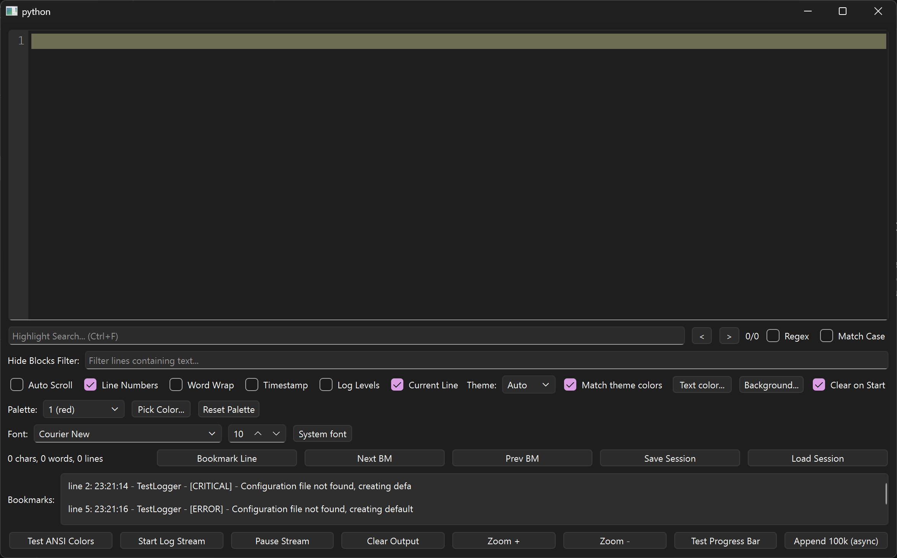
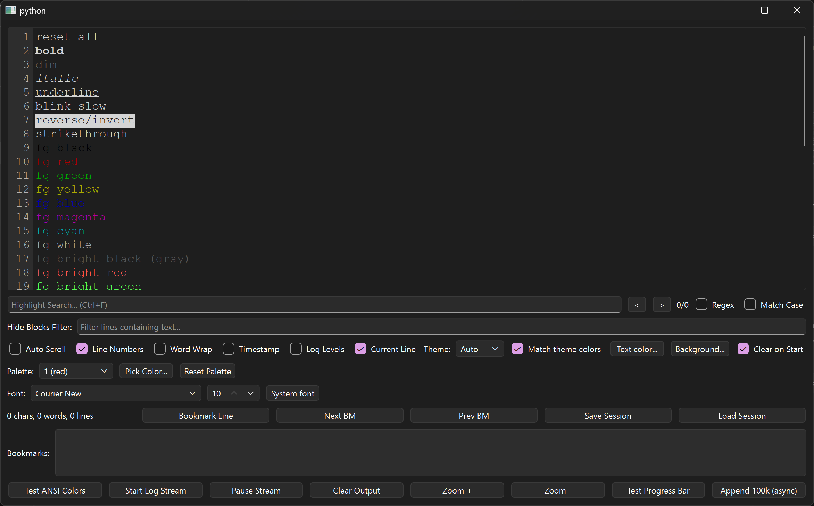
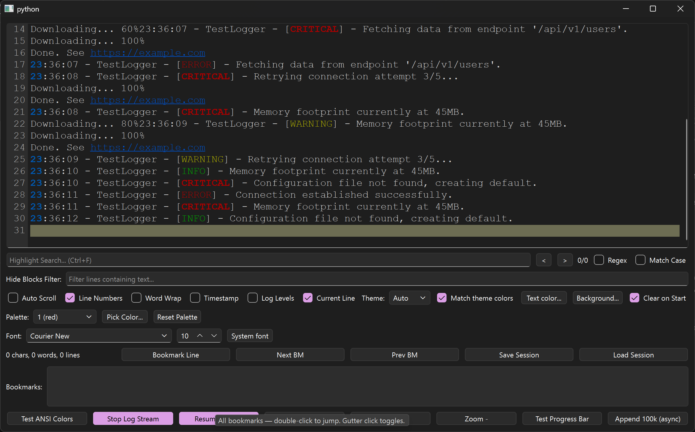
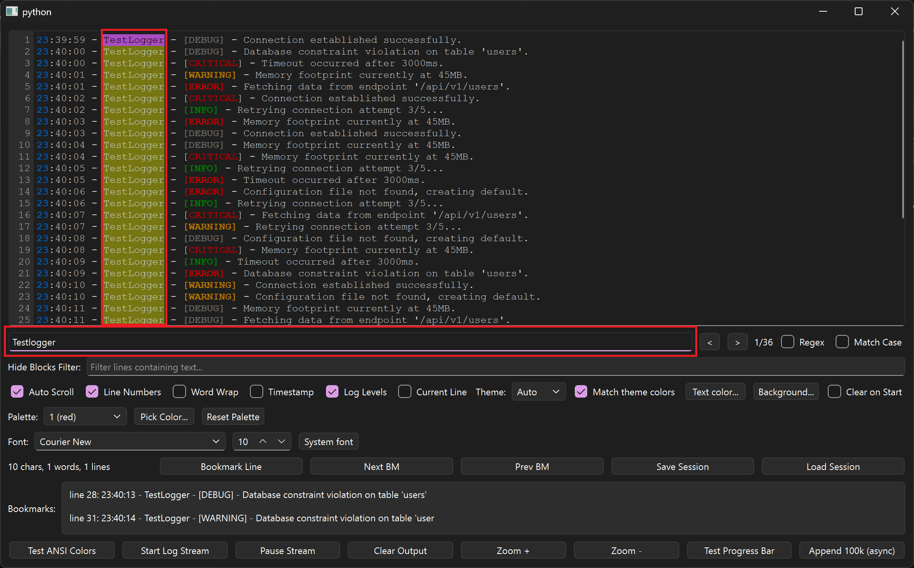
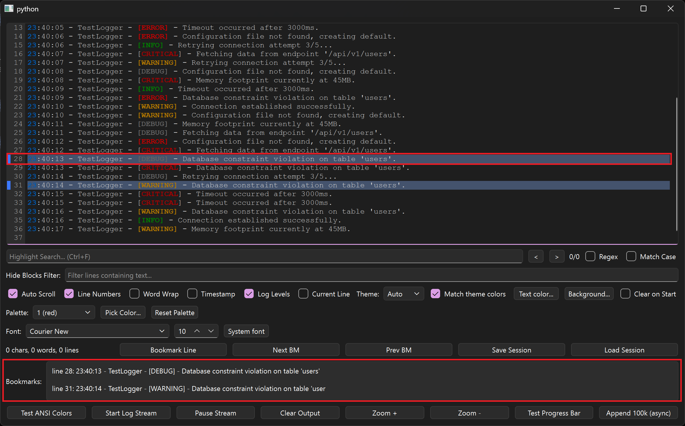
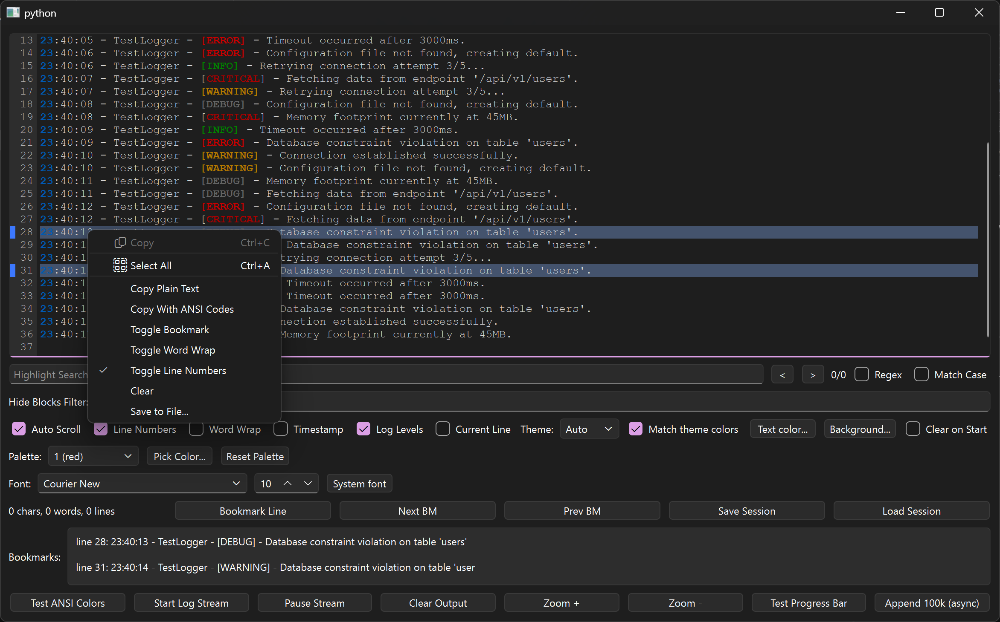
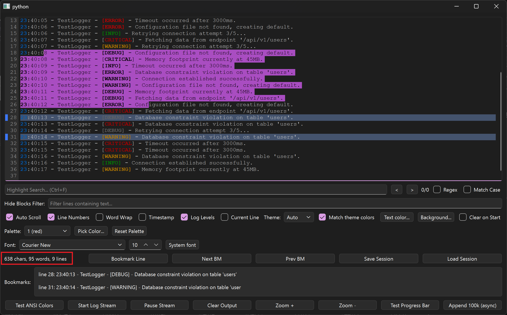
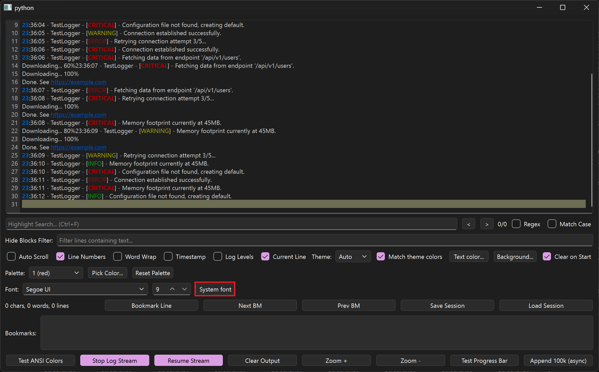
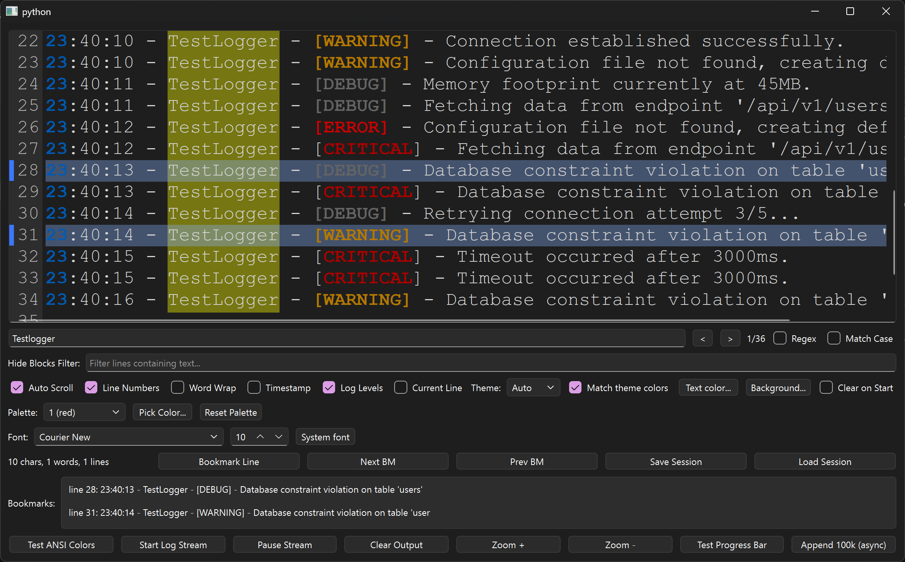
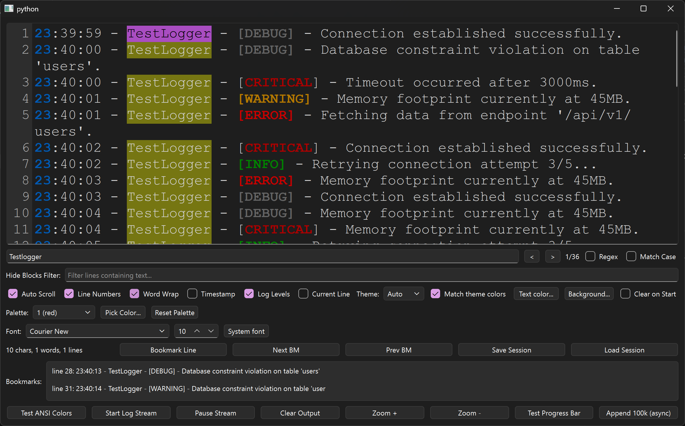

---
hide:
  - navigation
---

# Visual tour

Every screenshot below is the real demo (`just demo`) with the feature
toggled on. The red boxes are the author's own callouts — each section
explains what the marked control does and links the API behind it.

## The whole board

One window, six zones: the log view with gutter on top, search and filter
bars beneath it, option checkboxes, palette and font rows, the
stats/bookmark/session strip, and the action buttons at the bottom. Start
here to orient yourself, then follow the tour in order.

## ANSI colors, isolated per line

`Test ANSI Colors` prints every style and color, each terminated so styles
never bleed into the next line — compare bold, dim, italic, underline,
reverse-video, strikethrough, the 8 standard and 8 bright foregrounds, and
256-color plus true-color RGB samples. See
[Appending](api/viewer.md#appending-content).

## Streaming, line numbers, progress bars

`Start Log Stream` tails synthetic logs while `Downloading... 60% →
100%` lines overwrite in place via carriage returns. Blue underlined
`https://example.com` links open on ++ctrl++ + click; the olive bar is the
current-line highlight. See [Appending](api/viewer.md#appending-content)
and [Links](api/viewer.md#links).

## Search: matches, query, counter

Typing `Testlogger` lights up all 36 matches in yellow (active one in
orange) — the red boxes mark the match column, the query field, and the
`1/36` counter with `<` `>` steppers beside the Regex and Match Case
toggles. See [Search & filter](api/viewer.md#search-filter).

## Bookmarks: line and list

Line 28 glows blue and appears as `line 28: …` in the bottom list — the two
red boxes. Toggle with the button, by clicking the gutter, or from the
right-click menu; `Next BM` / `Prev BM` wrap around and skip filtered-out
lines. See [Bookmarks](api/viewer.md#bookmarks).

## Right-click menu

Copy, Select All, Copy Plain Text, Copy With ANSI Codes (SGR sequences
reconstructed from the real formats), Toggle Bookmark, Toggle Word Wrap,
Toggle Line Numbers, Clear, and Save to File. See
[Copy, export, sessions](api/viewer.md#copy-export-sessions).

## Selection statistics

Dragging across lines paints the purple selection and the red-boxed label
reports `638 chars, 95 words, 9 lines` live via `selectionStats()`. Behind
it you can also see bookmarked lines 28 and 31 in blue. See
[Copy, export, sessions](api/viewer.md#copy-export-sessions).

## System fonts

The red box marks `System font`: the view drops monospace for Segoe UI at
9pt — proportional rendering works, alignment just stops lining up, which
is exactly why monospace is the default. Pick any family and size from the
font row, or go back with `setMonospaceFont()`. See
[Fonts & zoom](api/viewer.md#fonts-zoom).

## Word wrap: off vs on

**Off** — long lines scroll sideways (`Word Wrap` unchecked):

**On** — the same lines reflow in place (`Word Wrap` checked):

Compare line 2, whose `'users'.` tail drops onto a continuation row. See
[Layout](api/viewer.md#layout-scroll-and-gutter).
