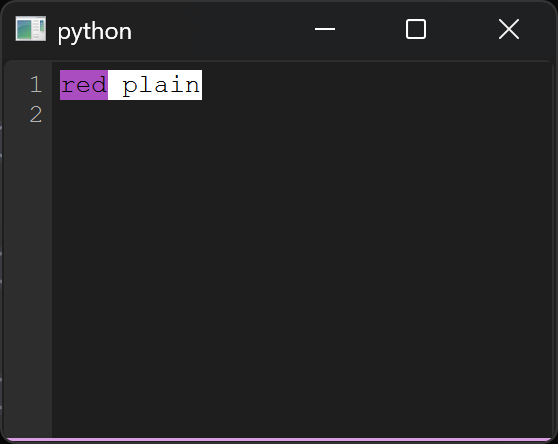

---
hide:
  - navigation
---

# QAnsiTextViewer

A Qt widget that renders ANSI-encoded log text — tail logs, search them,
bookmark lines, and save sessions, all behind a typed one-widget API.

<div class="grid cards" markdown>

-   :material-magnify: **Search & filter**

    Highlight with regex, jump with ++f3++, hide non-matching lines.

-   :material-bookmark: **Bookmarks**

    Gutter click, list panel, next/previous navigation, saved in sessions.

-   :material-palette: **Themes**

    Light, dark, OS-following auto, plus custom ANSI palettes.

-   :material-lightning-bolt: **Non-blocking**

    Chunked async appends keep the UI alive through 100k-line bursts.

</div>

## Install

=== "uv"

    ```bash
    uv add qansitextviewer
    ```

=== "pip"

    ```bash
    pip install qansitextviewer
    ```

Requires Python `>=3.11` and PySide6 `>=6.5.0`.

## Quick start

```python
from PySide6.QtWidgets import QApplication
from ansi_text_viewer import AnsiTextViewer

app = QApplication([])
viewer = AnsiTextViewer()
viewer.appendAnsiText("\x1b[31mred\x1b[0m plain\n")
viewer.highlight_search("red")  # F3 / Shift+F3 navigates, Esc clears
viewer.setTheme("dark")
viewer.show()
app.exec()
```

That snippet renders this — red ANSI text with the search match lit up:

{ width="420" }

!!! tip "Try the demo"
    `just demo` launches the full showcase: streaming logs, progress bars,
    bookmarks, sessions, themes, and palette pickers. Prefer pictures?
    [Take the visual tour](gallery.md) — every feature annotated.

## API reference

| Page | Contents |
| ---- | -------- |
| [Viewer](api/viewer.md) | `AnsiTextViewer` — every method, with examples |
| [Highlighting](api/highlighting.md) | `Span`, `HighlightRule`, all built-in rules |
| [Internals](api/internals.md) | ANSI decoding, search engine, gutter |

!!! warning "Untrusted logs"
    Log content is untrusted by design. Links open only on ++ctrl++ + click,
    cursor jumps are clamped, and huge lines are truncated. For hostile
    logs, call `viewer.setLinksEnabled(False)`.
